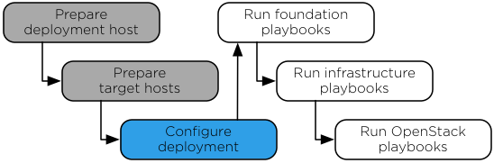

`Home <common-front.html>`__ OpenStack Ansible Installation Guide

Chapter 5. Deployment configuration
-----------------------------------

.. toctree:: 

	sec_configure-prerequisites
	sec_configure-networking
	sec_configure-hostlist
	sec_configure-creds
	sec_configure-hypervisor
	sec_configure-glance
	sec_configure-cinder
	sec_configure-cinder-nfs
	sec_cinder_backups
	sec_cinder-availabilityzones
	sec-configure-swift
	sec-configuring-swift
	sec-swift-storage-policies

**Figure 5.1. Installation work flow**

|image2|

| 

Ansible references a handful of files containing mandatory and optional
configuration directives. These files must be modified to define the
target environment before running the Ansible playbooks. Perform the
following tasks:

-  Configure Target host networking to define bridge interfaces and
   networks

-  Configure a list of target hosts on which to install the software

-  Configure virtual and physical network relationships for OpenStack
   Networking (neutron)

-  (Optional) Configure the hypervisor

-  (Optional) Configure Block Storage (cinder) to use the NetApp back
   end

-  (Optional) Configure Block Storage (cinder) backups.

-  (Optional) Configure Block Storage availability zones

-  Configure passwords for all services

--------------

.. include:: navigation.txt

