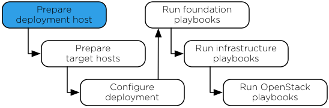

`Home <common-front.html>`__ OpenStack Ansible Installation Guide

Chapter 3. Deployment host
--------------------------

.. toctree:: 

	sec-hosts-deployment-os
	sec-hosts-deployment-add
	sec-hosts-deployment-rpc
	sec-hosts-deployment-sshkeys

**Figure 3.1. Installation work flow**

|image2|

| 

The RPC software installation process requires one deployment host. The
deployment host contains Ansible and orchestrates the RPC installation
on the target hosts. One of the target hosts, preferably one of the
infrastructure variants, can be used as the deployment host. To use a
deployment host as a target host, follow the steps in `Chapter 4,
*Target hosts* <ch-hosts-target.html>`__ on the deployment host. This
guide assumes separate deployment and target hosts.

--------------

.. include:: navigation.txt

