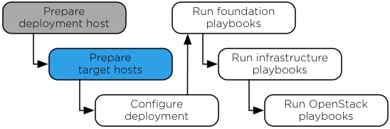

`Home <common-front.html>`__ OpenStack Ansible Installation Guide

Chapter 4. Target hosts
-----------------------

.. toctree:: 

	sec-hosts-target-os
	sec-hosts-target-sshkeys
	sec-hosts-target-add
	sec-config-lvm
	sec-hosts-target-network
	sec-hosts-target-network-refarch
	sec-hosts-target-network-example

**Figure 4.1. Installation workflow**

|image2|

| 

The RPC software installation process requires at least five target
hosts that will contain the OpenStack environment and supporting
infrastructure. On each target host, perform the following tasks:

-  Naming target hosts.

-  Install the operating system.

-  Generate and set up security measures.

-  Update the operating system and install additional software packages.

-  Create LVM volume groups.

-  Configure networking devices.

--------------

.. include:: navigation.txt

