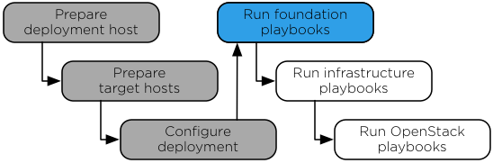

`Home <common-front.html>`__ OpenStack Ansible Installation Guide

Chapter 6. Foundation playbooks
-------------------------------

.. toctree:: 

	sec-hosts-haproxy
	sec-playbooks-foundation-run

**Figure 6.1. Installation work flow**

|image2|

The main Ansible foundation playbook prepares the target hosts for
infrastructure and OpenStack services and performs the following
operations:

-  Perform deployment host initial setup

-  Build containers on target hosts

-  Restart containers on target hosts

-  Install common components into containers on target hosts

--------------

.. include:: navigation.txt

