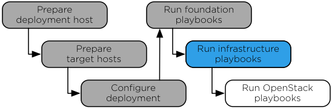

`Home <common-front.html>`__ OpenStack Ansible Installation Guide

Chapter 7. Infrastructure playbooks
-----------------------------------

.. toctree:: 

	sec-playbooks-infrastructure-run
	sec-playbooks-infrastructure-verify

**Figure 7.1. Installation workflow**

|image2|

| 

The main Ansible infrastructure playbook installs infrastructure
services and performs the following operations:

-  Install Memcached

-  Install Galera

-  Install RabbitMQ

-  Install Rsyslog

-  Install Elasticsearch

-  Install Logstash

-  Install Kibana

-  Install Elasticsearch command-line utilities

-  Configure Rsyslog

--------------

.. include:: navigation.txt

