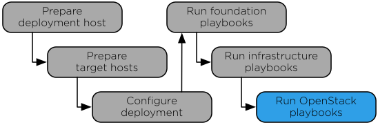

`Home <common-front.html>`__ OpenStack Ansible Installation Guide

Chapter 8. OpenStack playbooks
------------------------------

.. toctree:: 

	sec-utility-container-overview
	sec-playbooks-openstack-run
	sec-playbooks-openstack-verify

**Figure 8.1. Installation work flow**

|image2|

| 

The main Ansible OpenStack playbook installs OpenStack services and
performs the following operations:

-  Install common components

-  Create utility container that provides utilities to interact with
   services in other containers

-  Install Identity (keystone)

-  Generate service IDs for all services

-  Install the Image service (glance)

-  Install Orchestration (heat)

-  Install Compute (nova)

-  Install Networking (neutron)

-  Install Block Storage (cinder)

-  Install Dashboard (horizon)

-  Reconfigure Rsyslog

--------------

.. include:: navigation.txt

