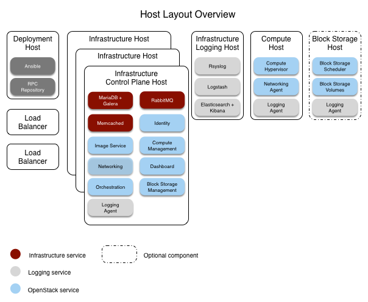

`Home <common-front.html>`__ OpenStack Ansible Installation Guide

Host layout
-----------

The recommended layout contains a minimum of five hosts (or servers).

-  Three control plane infrastructure hosts

-  One logging infrastructure host

-  One compute host

To use the optional Block Storage (cinder) service, a sixth host is
required. Block Storage hosts require an LVM volume group named
*cinder-volumes*. See `the section called "Installation
requirements" <sec_overview_requirements.html>`__ and `the section
called "Configuring LVM" <sec-config-lvm.html>`__ for more information.

The hosts are called *target hosts* because Ansible deploys the RPC
environment within these hosts. The RPC environment also requires a
*deployment host* from which Ansible orchestrates the deployment
process. One of the target hosts can function as the deployment host.

At least one hardware load balancer **must** be included to manage the
traffic among the target hosts.

Infrastructure Control Plane target hosts contain the following
services:

-  Infrastructure:

   -  Galera

   -  RabbitMQ

   -  Memcached

   -  Logging

-  OpenStack:

   -  Identity (keystone)

   -  Image service (glance)

   -  Compute management (nova)

   -  Networking (neutron)

   -  Orchestration (heat)

   -  Dashboard (horizon)

Infrastructure Logging target hosts contain the following services:

-  Rsyslog

-  Logstash

-  Elasticsearch with Kibana

Compute target hosts contain the following services:

-  Compute virtualization

-  Logging

(Optional) Storage target hosts contain the following services:

-  Block Storage scheduler

-  Block Storage volumes

**Figure 2.1. Host Layout Overview**

|image2|

| 

--------------

.. include:: navigation.txt

