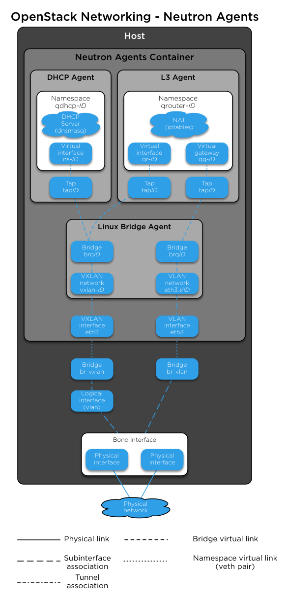
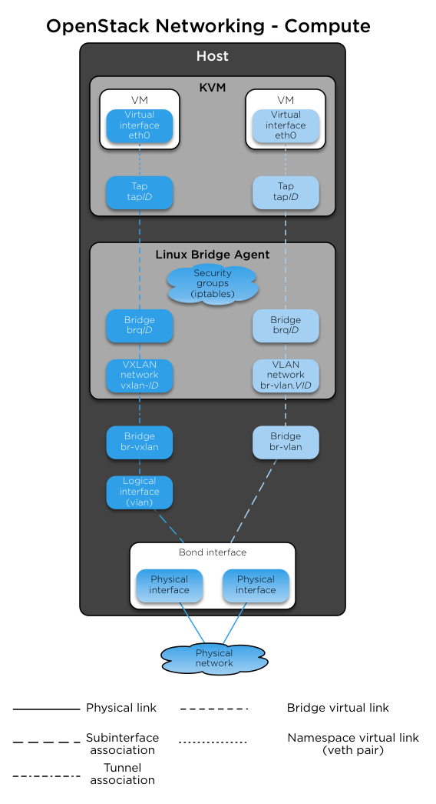

`Home <common-front.html>`__ OpenStack Ansible Installation Guide

OpenStack Networking
--------------------

OpenStack Networking (neutron) is configured to use a DHCP agent, L3
Agent and Linux Bridge agent within a networking agents container.
`Figure 2.5, "Networking agents
containers" <sec_overview_neutron.html#fig_overview_neutron-agents>`__
shows the interaction of these agents, network components, and
connection to a physical network.

 

**Figure 2.5. Networking agents containers**

|image2|

| 

The Compute service uses the KVM hypervisor. `Figure 2.6, "Compute
hosts" <sec_overview_neutron.html#fig_overview_neutron-compute>`__ shows
the interaction of instances, Linux Bridge agent, network components,
and connection to a physical network.

 

**Figure 2.6. Compute hosts**

|image3|

| 

--------------

.. include:: navigation.txt

